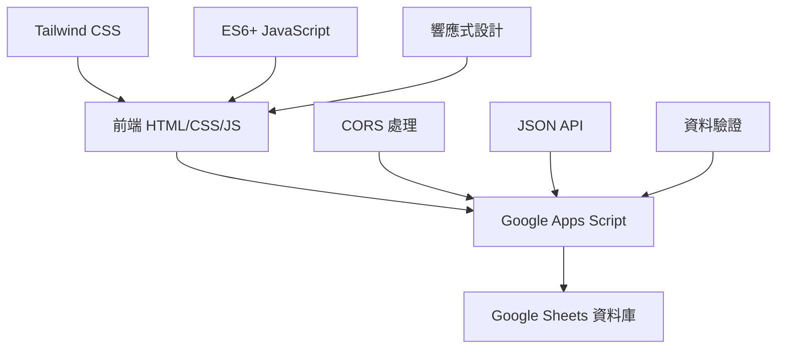

# 婚禮賓客管理系統 
## Wedding Guest Management System

> 🎉 **輕量級婚禮報到系統** - 基於 Google Sheets 的賓客管理解決方案  
> 提供直觀的網頁介面，讓工作人員輕鬆管理賓客報到、禮金收取和喜餅發放流程

---

## 📋 目錄
- [✨ 系統特色](#-系統特色)
- [🏗️ 系統架構](#️-系統架構) 
- [📦 快速開始](#-快速開始)
- [⚙️ 配置說明](#️-配置說明)
- [📁 專案結構](#-專案結構)
- [🔒 安全性](#-安全性)
- [📚 使用指南](#-使用指南)

---

## ✨ 系統特色

<table>
<tr>
<td width="50%">

### 🎯 報到畫面
**檔案**: `checkin.html`

✅ **賓客報到** - 序號 + 姓名雙重驗證  
✅ **禮金管理** - 即時記錄收取狀態和金額  
✅ **喜餅發放** - 追蹤婚禮喜餅配發情況  
✅ **備註功能** - 記錄特殊需求、處理狀態等資訊  
✅ **智能驗證** - 完整表單驗證和錯誤處理  
✅ **一鍵導航** - 快速回到賓客清單頁面  

</td>
<td width="50%">

### 📊 賓客清單  
**檔案**: `guestlist.html`

✅ **智能快取** - 完整資料載入，localStorage 持久化  
✅ **極速搜尋** - 序號/姓名毫秒級搜尋響應  
✅ **智能分頁** - 每頁20筆，流暢分頁體驗  
✅ **視覺化狀態** - 綠色標示已報到賓客  
✅ **點擊報到** - 直接跳轉到報到表單  
✅ **代碼品質** - 遵循 Linus 原則，消除特殊情況  

</td>
</tr>
</table>

---

## 🏗️ 系統架構

### 技術堆棧


| 層級 | 技術 | 說明 |
|------|------|------|
| **前端** | HTML5 + Tailwind CSS + Vanilla JS | 響應式介面，無需框架 |
| **後端** | Google Apps Script | 無伺服器架構，自動擴展 |
| **資料庫** | Google Sheets | 即時協作，無需設定 |
| **部署** | 靜態檔案 | 任何網頁伺服器皆可使用 |

### 資料流程
```
賓客報到 → 表單驗證 → Apps Script → Google Sheets → 即時更新清單
```

## 📦 快速開始

> ⚡ **5分鐘部署指南** - 從下載到運行，輕鬆完成系統設置

### 🔄 部署流程概覽
```
1️⃣ 下載程式碼 → 2️⃣ 設定 Google Sheets → 3️⃣ 部署 Apps Script → 4️⃣ 配置前端 → 5️⃣ 啟動系統
```

---

### 1️⃣ **下載專案**
```bash
git clone <your-repo-url>
cd WeddingSystem
```

### 2️⃣ **設定 Google Sheets**

#### 📊 建立新的 Google Sheets
1. 前往 [Google Sheets](https://sheets.google.com)
2. 建立新的工作表，命名為 `guestList`
3. 設定欄位結構如下：

| 欄位 | 名稱 | 資料類型 | 說明 |
|------|------|----------|------|
| **A** | 時間 | 日期時間 | 自動記錄報到時間 |
| **B** | 序號 | 文字 | 賓客編號 (必填) |
| **C** | 姓名 | 文字 | 賓客姓名 (必填) |  
| **D** | 收禮金 | 布林值 | TRUE/FALSE |
| **E** | 金額 | 數字 | 禮金金額 |
| **F** | 有喜餅 | 布林值 | TRUE/FALSE |
| **G** | 發喜餅 | 布林值 | TRUE/FALSE |

### 3️⃣ **部署 Google Apps Script**

#### 🚀 Apps Script 設定步驟  
<table>
<tr><td width="30%"><strong>步驟</strong></td><td><strong>操作</strong></td></tr>
<tr><td>1. 建立專案</td><td>前往 <a href="https://script.google.com">Google Apps Script</a> 建立新專案</td></tr>
<tr><td>2. 貼上程式碼</td><td>複製 <code>backend/google-apps-script.example.js</code> 內容</td></tr>
<tr><td>3. 設定 Sheets ID</td><td>替換 <code>YOUR_SPREADSHEET_ID_HERE</code> 為實際 ID</td></tr>
<tr><td>4. 部署設定</td><td><strong>執行身分</strong>：我<br><strong>存取權限</strong>：任何人</td></tr>
<tr><td>5. 取得 URL</td><td>複製部署後的 Web App URL</td></tr>
</table>

### 4️⃣ **配置前端**

#### ⚙️ 設定配置檔案
```bash
# 複製範例配置
cp src/config/config.example.js src/config/config.js
```

#### 📝 編輯 src/config/config.js
```javascript
window.CONFIG = {
    // 🔗 貼上你的 Google Apps Script URL
    GOOGLE_SCRIPT_URL: 'https://script.google.com/macros/s/YOUR_SCRIPT_ID/exec',
    
    GOOGLE_SHEETS: {
        SPREADSHEET_ID: 'your-sheets-id',  // 📊 Sheets ID
        SHEET_NAME: 'guestList'            // 📋 工作表名稱  
    },
    
    SYSTEM: {
        AUTO_REFRESH_INTERVAL: 30000,      // ⏱️ 30秒自動刷新
        PAGINATION: { DEFAULT_PAGE_SIZE: 20 } // 📄 每頁20筆
    }
};
```

### 5️⃣ **啟動系統**

#### 🌐 選擇你的伺服器方式
<table>
<tr>
<td width="33%">

**🐍 Python**
```bash
python -m http.server 8000
```

</td>
<td width="33%">

**📦 Node.js**  
```bash
npx http-server
```

</td>
<td width="33%">

**📁 直接開啟**
```bash
# 雙擊 HTML 檔案即可
```

</td>
</tr>
</table>

#### 🎯 訪問系統
| 功能 | 網址 | 說明 |
|------|------|------|
| 📝 **報到畫面** | `http://localhost:8000/src/pages/checkin.html` | 賓客報到表單 |
| 📊 **賓客清單** | `http://localhost:8000/src/pages/guestlist.html` | 報到狀態總覽 |

---

## 📁 專案結構

### 📂 檔案組織架構
```
WeddingSystem/
├── 📱 src/                          # 前端源碼
│   ├── pages/
│   │   ├── checkin.html             # 📝 賓客報到介面
│   │   └── guestlist.html           # 📊 賓客清單顯示
│   ├── config/
│   │   ├── config.example.js        # 🔧 配置範例 (上傳到 GitHub)
│   │   └── config.js                # 🔐 實際配置 (本地使用，已忽略)
│   └── assets/                      # 🎨 靜態資源
│       └── css/                     # 自定義樣式 (預留)
│
├── 📋 backend/                      # 後端代碼
│   ├── google-apps-script.example.js # 📋 Apps Script 範例
│   └── google-apps-script.js        # 🔐 實際代碼 (本地使用，已忽略)
│
├── 📚 docs/                         # 文檔資料
│   ├── CHANGELOG.md                 # 📝 開發日誌
│   ├── user-manual.md               # 📖 使用者操作手冊
│   └── quick-start.md               # ⚡ 快速啟動指南
│
├── 📖 README.md                     # 使用說明 (本文件)
├── 🔧 CLAUDE.md                     # Claude 指令文檔
└── 🚫 .gitignore                    # 版本控制忽略規則
```

### 🔒 安全檔案說明
| 檔案類型 | GitHub 狀態 | 說明 |
|----------|-------------|------|
| `*.example.js` | ✅ **已上傳** | 安全的範例文件，供參考使用 |
| `src/config/config.js` | ❌ **已忽略** | 包含 Apps Script URL，敏感資訊 |
| `backend/google-apps-script.js` | ❌ **已忽略** | 包含 Sheets ID，敏感資訊 |

---

## ⚙️ 配置說明

### 🔧 config.js 完整配置範例

<details>
<summary><strong>點擊展開完整配置選項</strong></summary>

```javascript
window.CONFIG = {
    // 🌐 Google Apps Script Web App 配置
    GOOGLE_SCRIPT_URL: 'https://script.google.com/macros/s/YOUR_SCRIPT_ID/exec',
    
    // 📊 Google Sheets 配置 (用於後端 Apps Script)
    GOOGLE_SHEETS: {
        SPREADSHEET_ID: 'your-google-sheets-id',
        SHEET_NAME: 'guestList'
    },
    
    // ⚙️ 系統設定
    SYSTEM: {
        // ⏱️ 自動刷新設定
        AUTO_REFRESH_INTERVAL: 30000,    // 30 秒 (毫秒)
        
        // 📄 分頁設定  
        PAGINATION: {
            DEFAULT_PAGE_SIZE: 20,       // 每頁 20 筆資料
            MAX_PAGE_SIZE: 100          // 最大每頁 100 筆
        },
        
        // 🎨 介面設定
        UI: {
            APP_NAME: '婚禮賓客管理系統',
            VERSION: '1.0.0',
            THEME: 'default'
        },
        
        // 🔍 搜尋設定
        SEARCH: {
            MIN_SEARCH_LENGTH: 1,        // 最少輸入 1 字元開始搜尋
            SEARCH_DELAY: 300           // 搜尋延遲 300ms
        }
    }
};
```

</details>

### 📝 配置項目說明

<table>
<tr><td width="20%"><strong>設定類別</strong></td><td width="30%"><strong>設定項目</strong></td><td><strong>說明</strong></td></tr>
<tr><td rowspan="2"><strong>🌐 連接設定</strong></td><td><code>GOOGLE_SCRIPT_URL</code></td><td>Google Apps Script 部署後的 Web App URL</td></tr>
<tr><td><code>SPREADSHEET_ID</code></td><td>Google Sheets 的唯一識別 ID</td></tr>
<tr><td rowspan="2"><strong>⚡ 效能設定</strong></td><td><code>AUTO_REFRESH_INTERVAL</code></td><td>賓客清單自動刷新間隔時間</td></tr>
<tr><td><code>DEFAULT_PAGE_SIZE</code></td><td>分頁顯示的資料筆數</td></tr>
</table>

---

## 🔒 安全性

### 🛡️ 安全特色
<table>
<tr>
<td width="25%"><strong>🔐 資料保護</strong></td>
<td>所有敏感配置透過 <code>.gitignore</code> 排除版本控制</td>
</tr>
<tr>
<td><strong>🌐 跨域處理</strong></td>
<td>Google Apps Script 完整的 CORS 標頭支援</td>
</tr>
<tr>
<td><strong>☁️ 無伺服器</strong></td>
<td>減少攻擊面，Google 雲端基礎設施保護</td>
</tr>
<tr>
<td><strong>🔑 權限控制</strong></td>
<td>透過 Google Apps Script 部署權限管理存取</td>
</tr>
</table>

### ⚠️ 安全注意事項
- 🚫 **不要** 將 `config.js` 或實際的 Apps Script 代碼上傳到公開儲存庫
- ✅ **建議** 定期更換 Google Apps Script 部署 URL 
- 🔒 **限制** Google Sheets 的編輯權限給必要人員

---

## 📚 使用指南

> 📖 **詳細操作手冊**：請參考 [`docs/user-manual.md`](docs/user-manual.md)  
> 包含完整的系統操作步驟、工作人員培訓指引和常見問題解答

### 🌐 瀏覽器相容性

| 瀏覽器 | 最低版本 | 狀態 | 備註 |
|-------|----------|------|------|
| 🟢 **Chrome** | 60+ | ✅ 推薦 | 最佳效能表現 |
| 🟠 **Firefox** | 60+ | ✅ 支援 | 良好相容性 |
| 🔵 **Safari** | 12+ | ✅ 支援 | iOS 裝置友好 |
| 🟦 **Edge** | 79+ | ✅ 支援 | Chromium 核心 |

> **技術要求**: ES6+, Fetch API, CSS Grid

### ⚡ 性能指標

<table>
<tr><td width="30%"><strong>功能</strong></td><td width="30%"><strong>響應時間</strong></td><td><strong>說明</strong></td></tr>
<tr><td>🔍 <strong>即時搜尋</strong></td><td>&lt; 10ms</td><td>本地資料搜尋，毫秒級響應</td></tr>
<tr><td>📄 <strong>分頁切換</strong></td><td>&lt; 5ms</td><td>前端分頁，無需伺服器請求</td></tr>
<tr><td>📊 <strong>首次載入</strong></td><td>3-5s</td><td>自動載入全部資料（如150筆），智能快取</td></tr>
<tr><td>🔄 <strong>頁面跳轉</strong></td><td>0延遲</td><td>使用 localStorage 持久化快取</td></tr>
<tr><td>💾 <strong>資料提交</strong></td><td>1-3s</td><td>視網路狀況而定</td></tr>
</table>

### 🎯 最佳實踐

<details>
<summary><strong>點擊查看使用建議</strong></summary>

#### 🧪 **部署前測試**
1. 先建立測試用的 Google Sheets 
2. 使用少量測試資料驗證功能
3. 確認所有流程正常運作後再正式部署

#### 💾 **資料管理**
1. 定期匯出 Google Sheets 資料備份
2. 設定 Google Sheets 共享權限（編輯/檢視）
3. 建議每週檢查資料完整性

#### 👥 **多人使用**
1. 指派專人負責系統管理
2. 培訓工作人員基本操作流程  
3. 準備操作手冊供現場參考

#### 🔧 **效能優化**
1. 控制 Google Sheets 資料筆數（建議 < 1000筆）
2. 定期清理測試資料
3. 避免同時大量匯入資料

</details>

### 📱 行動裝置支援

- ✅ **響應式設計** - 自動適應螢幕尺寸
- ✅ **觸控友好** - 大按鈕、易點擊介面  
- ✅ **離線搜尋** - 資料載入後可離線搜尋
- ❌ **離線提交** - 需要網路連線進行報到

---

## 🛠️ 技術限制 & 解決方案

### ⏱️ Google Apps Script 限制
<table>
<tr><td width="30%"><strong>限制項目</strong></td><td width="20%"><strong>限制值</strong></td><td><strong>建議處理方式</strong></td></tr>
<tr><td>每日執行時間</td><td>6 小時</td><td>一般婚禮使用量遠低於限制</td></tr>
<tr><td>單次請求時間</td><td>6 分鐘</td><td>系統請求通常 &lt; 3 秒完成</td></tr>
<tr><td>同步執行限制</td><td>6 分鐘</td><td>採用非同步處理，避免長時間執行</td></tr>
</table>

### 🔄 多人協作考量
- **潛在問題**: 同時編輯同一筆資料可能覆蓋
- **建議方案**: 依桌次或區域分配不同工作人員
- **監控方式**: 定期檢查 Google Sheets 編輯歷史

---

## 🤝 參與貢獻

### 💡 歡迎貢獻

我們歡迎各種形式的貢獻！請參考以下指引：

#### 📋 提交 Issue
- 🐛 **Bug 報告**: 請詳細描述問題和重現步驟
- 💡 **功能建議**: 說明期望功能和使用場景
- 📚 **文件改進**: 指出不清楚或遺漏的部分

#### 🔧 提交 Pull Request  
1. **Fork** 專案到你的 GitHub 帳戶
2. **創建** 功能分支 (`git checkout -b feature/AmazingFeature`)
3. **提交** 你的修改 (`git commit -m 'Add some AmazingFeature'`)
4. **推送** 分支 (`git push origin feature/AmazingFeature`)
5. **建立** Pull Request

#### ⚠️ 貢獻注意事項
- ✅ 遵循現有的代碼風格和註釋習慣
- ✅ 為新功能添加適當的說明文件
- ✅ 確保不會提交敏感配置文件 
- ✅ 測試你的修改在不同瀏覽器上的表現

---

## 📞 支援與社群

### 🆘 取得協助
- **📋 GitHub Issues**: [專案 Issues 頁面](https://github.com/your-repo/issues)
- **📖 文件**: 參閱 `docs/CHANGELOG.md` 查看詳細開發記錄
- **⚡ 快速指南**: 查看 `docs/quick-start.md` 獲得快速部署說明

### 📄 授權資訊
本專案採用 **MIT License** 授權 - 詳見 [LICENSE](LICENSE) 檔案

---

## 💭 結語

> 💡 **設計理念**  
> 這是一個 **輕量級** 的婚禮管理系統，專為 **中小型婚禮** 設計。  
> 我們相信 **簡單就是美**，透過最小化的技術複雜度，  
> 讓每場婚禮都能擁有 **專業** 且 **易用** 的賓客管理體驗。

### 🎯 適用場景
- ✅ **100-500 人**的中型婚禮
- ✅ 需要 **多工作站** 同時報到
- ✅ 重視 **禮金管理** 的透明度
- ✅ 希望 **無需複雜設定** 即可使用

### 🚀 未來發展
查看 `docs/CHANGELOG.md` 了解最新功能開發計劃！

---

<p align="center">
<strong>🎉 祝福每一對新人都有一個完美的婚禮！ 🎉</strong>
</p>